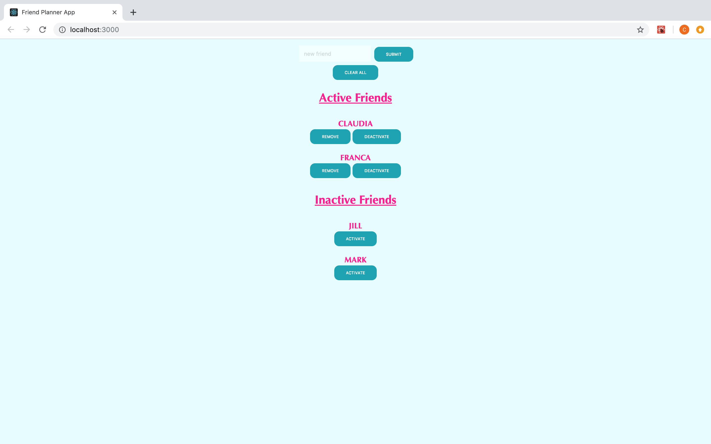

# React Friends Planner App

A simple App for managing Friends, implemented with React.

## Home Page

## Objectives of the exercise

Getting confident at using React for building UI and giving them interaction with some functionalities. 
A Friends Manager App, divided into 2 unordered lists: Active Friends, with two buttons with different usage (Remove or Deactivate - setting the state from Active to Inactive), and Inactive Friends with an activate Button (setting the state from Inactive to Active).
We add new Friends in the Active section, from the Input type and with the Submit button.
We can clear the app, removing all the elements in the lists, pressing the Clear All button.

## Main challenges that I've faced

- Create stateless functional components (Input and Button): assigning props (name, type, value, onChange, onClick) with destructuring
- Create stateless functional components (Active and Inactive Friends): assigning props (list, onRemoveFriend, onToggleFriend) with destructuring, working with keys for lists and methods - .map()
- Create stateful class component (App) receiving props from the stateless imported components and managing its internal state (array of objects with two key-value pairs: friends.name and friend.active/inactive)
- Add an initial state to the class constructor
- Manage and update the current state with setState()
- Handle events (Update - AddFriend - RemoveFriend - Toggle) and bind them using arrow functions
- Collect new data (Submit/HandleAddFriend) in the Active Friends list
- Changing the state with Deactivate (setting the state from Active to Inactive with HandleToggleFriend) or activate (setting the state from Inactive to Active with HandleToggleFriend) and moving data from a list to the other one.
- Clear the current state (Clear All)

## Topics 
- lists and Keys
- Destructuring assignment and arrow functions
- Separation of concerns (organising components in different files, working with modules and imported/exported (named or default) Elements)
- Array prototypes / .concat() - .find() - .filter() - .map() 

This project was bootstrapped with [Create React App](https://github.com/facebook/create-react-app).

## Available Scripts

In the project directory, you can run:

### `npm start`

Runs the app in the development mode. 
Open [http://localhost:3000](http://localhost:3000) to view it in the browser.

The page will reload if you make edits. 
You will also see any lint errors in the console.

### `npm test`

Launches the test runner in the interactive watch mode. 
See the section about [running tests](https://facebook.github.io/create-react-app/docs/running-tests) for more information.

### `npm run build`

Builds the app for production to the `build` folder. 
It correctly bundles React in production mode and optimizes the build for the best performance.

The build is minified and the filenames include the hashes. 
Your app is ready to be deployed!

See the section about [deployment](https://facebook.github.io/create-react-app/docs/deployment) for more information.

### `npm run eject`

**Note: this is a one-way operation. Once you `eject`, you can’t go back!**

If you aren’t satisfied with the build tool and configuration choices, you can `eject` at any time. This command will remove the single build dependency from your project.

Instead, it will copy all the configuration files and the transitive dependencies (Webpack, Babel, ESLint, etc) right into your project so you have full control over them. All of the commands except `eject` will still work, but they will point to the copied scripts so you can tweak them. At this point you’re on your own.

You don’t have to ever use `eject`. The curated feature set is suitable for small and middle deployments, and you shouldn’t feel obligated to use this feature. However we understand that this tool wouldn’t be useful if you couldn’t customize it when you are ready for it.

## Learn More

You can learn more in the [Create React App documentation](https://facebook.github.io/create-react-app/docs/getting-started).

To learn React, check out the [React documentation](https://reactjs.org/).

### Code Splitting

This section has moved here: https://facebook.github.io/create-react-app/docs/code-splitting

### Analyzing the Bundle Size

This section has moved here: https://facebook.github.io/create-react-app/docs/analyzing-the-bundle-size

### Making a Progressive Web App

This section has moved here: https://facebook.github.io/create-react-app/docs/making-a-progressive-web-app

### Advanced Configuration

This section has moved here: https://facebook.github.io/create-react-app/docs/advanced-configuration

### Deployment

This section has moved here: https://facebook.github.io/create-react-app/docs/deployment

### `npm run build` fails to minify

This section has moved here: https://facebook.github.io/create-react-app/docs/troubleshooting#npm-run-build-fails-to-minify
